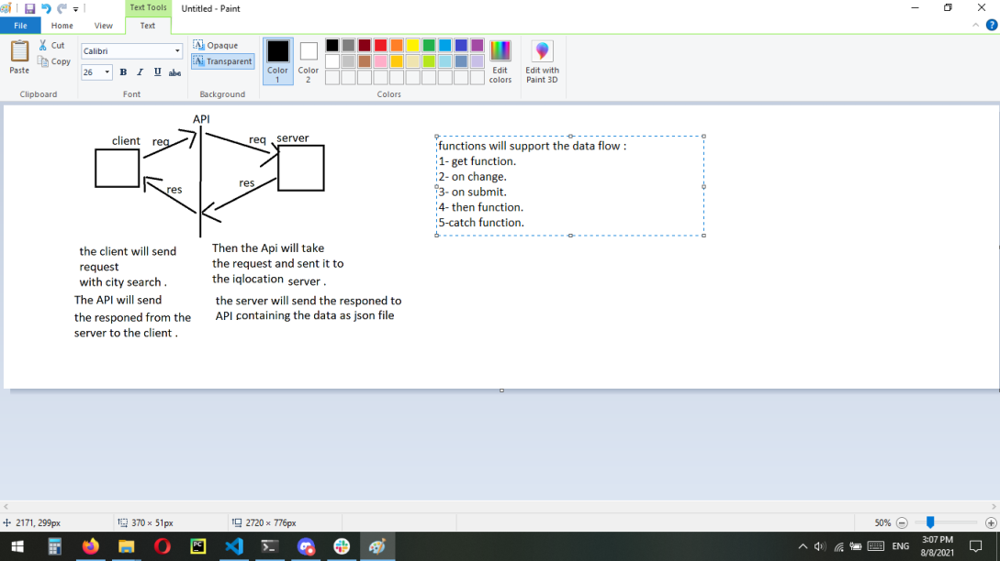

# city-explorer

**Author**: Balqees
**Version**: 1.0.0 (increment the patch/fix version number if you make more commits past your first submission)

## Overview
<!-- Provide a high level overview of what this application is and why you are building it, beyond the fact that it's an assignment for this class. (i.e. What's your problem domain?) -->

## Getting Started
<!-- What are the steps that a user must take in order to build this app on their own machine and get it running? -->

## Architecture
<!-- Provide a detailed description of the application design. What technologies (languages, libraries, etc) you're using, and any other relevant design information. -->

## Change Log
<!-- Use this area to document the iterative changes made to your application as each feature is successfully implemented. Use time stamps. Here's an example:

01-01-2001 4:59pm - Application now has a fully-functional express server, with a GET route for the location resource. -->

## Credit and Collaborations
---
# Lab 6 :

## feature 1 : display the location

+ Name of feature: display location

+ Estimate of time needed to complete: 3 hours

+ Start time: 2:15 pm

+ Finish time: 6 pm

+ Actual time needed to complete: 3 hours

## feature 2 : display map 

+ Name of feature: map

+ Estimate of time needed to complete: 2 hours

+ Start time: 2:00 pm

+ Finish time: 4:00 pm

+ Actual time needed to complete: 2 hours

---

# lab 7 :

## feature 1 : display the weather 

+ Name of feature: display weather

+ Estimate of time needed to complete: 6 hours

+ Start time: 2: pm

+ Finish time: 1am

+ Actual time needed to complete: 3 hours

## feature 2 : display error msg

+ Name of feature: error

+ Estimate of time needed to complete: 2 hours

+ Start time: 3:00 pm

+ Finish time: 5:00 pm

+ Actual time needed to complete: 2 hours

---

# lab 8 :

## feature 1 : display the weather for any city

+ Name of feature: display weather

+ Estimate of time needed to complete: day

+ Start time: 2:15 pm

+ Finish time: 2am

+ Actual time needed to complete: week

## feature 2 : display movies 

+ Name of feature: movies

+ Estimate of time needed to complete: 3 hours

+ Start time: 3:00 pm

+ Finish time: 6:00 pm

+ Actual time needed to complete: 2 hours

---

# lab 9 :

## feature 1 : Modularize the back-end

+ Name of feature: Modularize the back-end code

+ Estimate of time needed to complete: 30 min

+ Start time: 2:00 pm

+ Finish time: 2:30 pm

+ Actual time needed to complete: 20 min

---

# lab 10 :

## feature 1 : Update the modules to require in the cache object. 

+ Name of feature: cache 

+ Estimate of time needed to complete: 30 min

+ Start time: 2:00 pm

+ Finish time: 2:30 pm

+ Actual time needed to complete: 20 min

## feature 2: Add an environment variable to in server named `YELP_API_KEY` 

+ Name of feature: yelp 

+ Estimate of time needed to complete: 30 min

+ Start time: 2:00 pm

+ Finish time: 2:30 pm

+ Actual time needed to complete: 20 min

